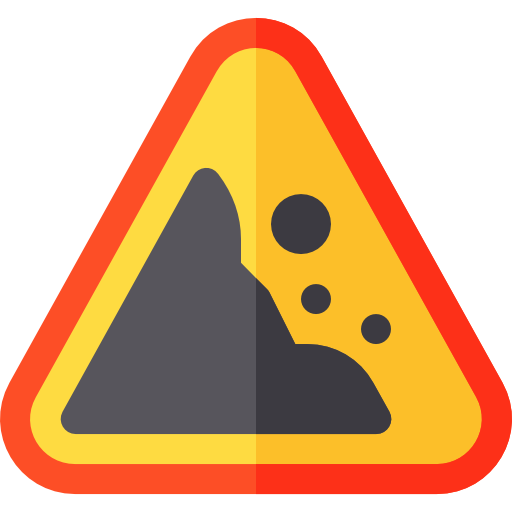

<a href="icon.png"></a> ErosionFinder
==================================


[](https://www.nuget.org/packages/ErosionFinder/)

ErosionFinder is a library to find architectural erosion across C# code; it uses the Roslyn API to navigate throught all components from some C# solution, and checks for architectural violations based on informed rules.

There is also a command-line interface, which can be viewed [here](https://github.com/rafaatsouza/erosion-finder-cli).

Installation
------------

[ErosionFinder is available on NuGet](https://www.nuget.org/packages/ErosionFinder). It can be installed with:
```
Install-Package ErosionFinder
```

Example
------------
```csharp
using ErosionFinder;
using ErosionFinder.Data.Models;
using Microsoft.Build.Locator;
using System.Collections.Generic;
using System.Text.RegularExpressions;
using System.Threading.Tasks;

namespace Sample
{
  static class Program
  {
    static Program()
    {
      MSBuildLocator.RegisterDefaults();
    }

    static async Task Main(string[] args)
    {
      var serviceLayerRegex = new Regex(@"(TargetSolutionNamespace)(.+)(\w*(Service([s]{1})?)\b)");
      var modelLayerRegex = new Regex(@"(TargetSolutionNamespace)(.+)(\w*(Model([s]{1})?)\b)");

      var constraints = new ArchitecturalConstraints()
      {
        Layers = new Dictionary<string, NamespacesGroupingMethod>()
        {
          { "Services", new NamespacesRegularExpressionGrouped(serviceLayerRegex) },
          { "Models", new NamespacesRegularExpressionGrouped(modelLayerRegex) }
        },
        Rules = new List<ArchitecturalRule>()
        {
          new ArchitecturalRule("Services", "Models", RuleOperator.OnlyCanRelate, 
            RelationType.ReturnByFunction, RelationType.ReceiptByMethodArgument)
        }
      };

      var solutionFilePath = @"C:\Users\MyUser\Documents\TargetSolution\TargetSolution.sln";

      var result = await ErosionFinderMethods.CheckArchitecturalConformanceAsync(
          solutionFilePath, constraints, default);
    }
  }
}
```

<sub>*Icon made by [Freepik](https://www.flaticon.com/authors/freepik) from https://www.flaticon.com*</sub>
